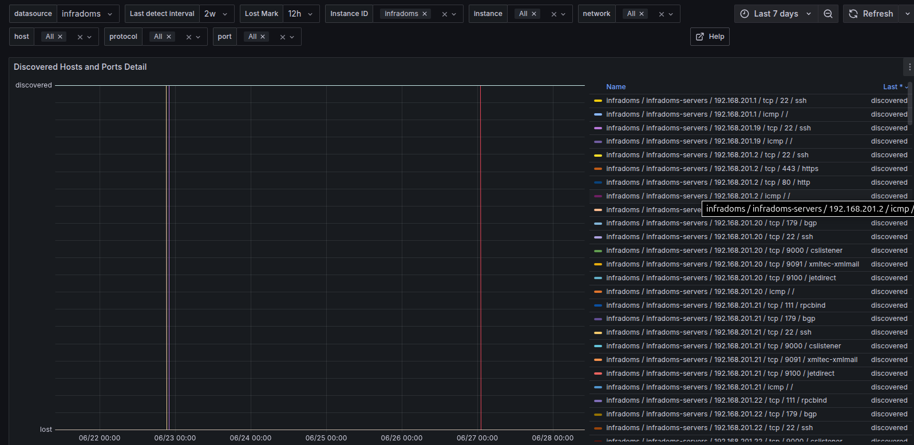

# 🔍 Prometheus Net Discovery

**A Prometheus exporter for lightweight network scanning.**\
Scans IP ranges and ports using `nmap`, and exposes results as Prometheus metrics.

---

## 🚀 Features

- 🔧 Scans subnets, IP ranges, and custom ports
- ⚡ Fast parallel discovery with optional deep scan
- 📡 Prometheus-compatible `/metrics` endpoint
- 📊 Grafana Dashboard included
- 🐳 Supports Docker and Helm (Kubernetes)

## 🧾 Dependencies
- nmap (binary)

## Based on
- [github.com/Ullaakut/nmap (library)](https://github.com/Ullaakut/nmap) 

---

## 📦 Running

### From binaries

```bash
go build ./cmd/prometheus-net-discovery -o prometheus-net-discovery
./prometheus-net-discovery --config ./cmd/prometheus-net-discovery/config.yaml
```

### Docker image

```bash
docker run --rm --name prometheus-net-discovery \
       -p 8080:8080 \
       -v $(pwd)/cmd/prometheus-net-discovery/config.yaml:/config.yaml \
       docker.io/londinzer/prometheus-net-discovery  \
       --config /config.yaml
```

### Helm chart (kubernetes)

```bash
helm repo add prometheus-net-discovery https://londinz.github.io/helm-charts
helm install prometheus-net-discovery prometheus-net-discovery/prometheus-net-discovery
```

## ⚙️ Configuration

Configuration is provided via a YAML file:

```yaml
global:
  instanceId: prometheus-net-discovery

scanners:
  - network: internal-net
    interval: 30m
    deep: true
    concurrency: 10
    targets:
      - 192.168.30.0/29
    ping: true
    ports:
      - 1-1024,3306,5432,6379,8080-8090
```

| Field     | Description                        |
| --------------- | ---------------------------------- |
| `network`       | Network name                       |
| `interval`      | Interval of discovery              |
| `deep`          | Deep scan of network (online and offile hosts on icmp ping) |
| `concurrency`   | Concurrency of discovery           |
| `targets`       | IP range or list of IPs            |
| `ping`          | Allow ICMP ping discovery          |
| `ports`         | List of ports to scan (now only tcp) |

## 📊 Prometheus metrics

| Metric name                         | Type      | Description                                                        | Labels                                                                                  |
|-----------------------------------|-----------|--------------------------------------------------------------------|-----------------------------------------------------------------------------------------|
| `net_discovery_discovery_running`                | Gauge     | State of running process of discovery. 1 if running, 0 otherwise  | `instance_id`, `network`                                                                                       |
| `net_discovery_collection_duration` | Histogram | Duration of collections in seconds                                | `instance_id`, `network`, `le`                                                          |
| `net_discovery_collection_duration_last` | Gauge     | Duration of last collection in seconds                            | `instance_id`, `network`                                                                 |
| `net_discovery_collection_total`  | Counter   | Total count of collections                                         | `instance_id`, `network`                                                                 |
| `net_discovery_discovered_host`   | Gauge     | Discovered hosts with ports and ICMP status                       | `host`,`instance_id`, `network`, `port`, `protocol`, `srv`    |

## Grafana dashboard

Get grafana dashboard `./dashboards/prometheus-net-discovery.json`




